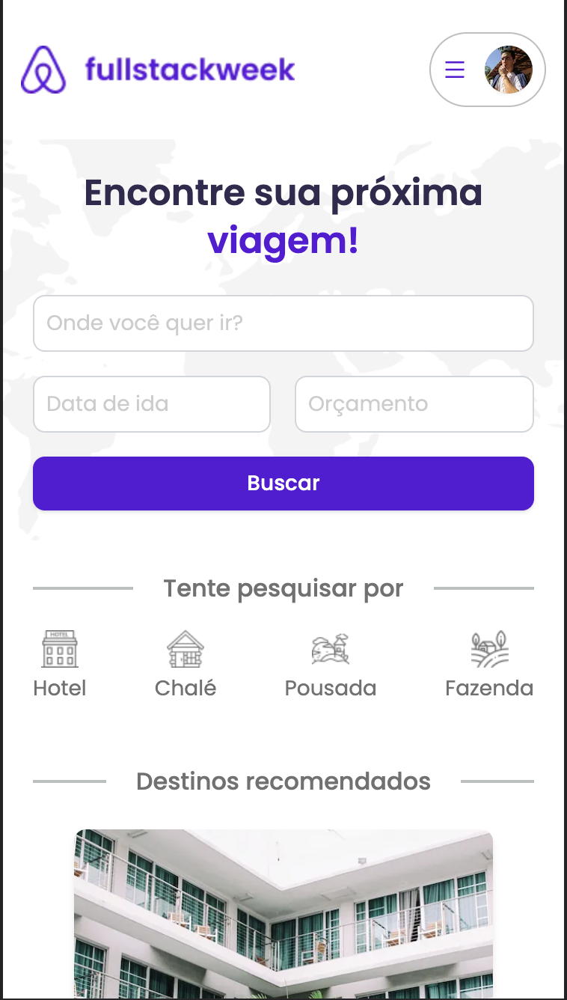

# ✈️ FullstackWeek Trips: Acomodações e viagens

```
O SERVIÇO ESTÁ EM FASE BETA E ENCONTRA-SE SUJEITA A ALTERAÇÕES
```

Conectando você às melhores aventuras e acomodações em uma viagem de conhecimento sem fronteiras!




## Uma solução completa de viagens usando Next.js 13.4

Com o objetivo de mostrar o que há de mais moderno no mercado, o Fullstack Week Trips foi desenvolvido pensando em agregar com o que há de melhor no mundo do programação web, trazendo como novidade o uso do mais recente _Next.js 13.4_

Todo o sistema possui uma UI e UX agradável construída em cima do Figma e implementado através do TailwindCSS.

O usuário pode se conectar com sua conta Google de forma segura, realizar pagamentos e verificar as reservas feitas. Tudo numa única aplicação extremamente veloz e altamente poderosa.
## Features

- Tecnologia de ponta: Desenvolvido com a mais moderna tecnologia web, o FullstackWeek Trips utiliza o Next.js 13.4. Essa framework poderoso e versátil permite criar aplicações web de alto desempenho, garantindo uma experiência de usuário excepcional.

- Autenticação fácil e segura: Implementamos a autenticação com Google através do NextAuth, proporcionando um processo de login simples e confiável. Com apenas alguns cliques, você pode acessar sua conta com segurança e começar a explorar nossas opções de viagens.

- Respostas rápidas do banco de dados: Para oferecer uma experiência ágil, integramos o Prisma, o Supabase e o PostgreSQL. Essas tecnologias trabalham em conjunto para fornecer respostas rápidas do banco de dados, permitindo que você encontre e reserve acomodações e viagens de forma eficiente.

- Pagamento seguro: Nosso sistema utiliza o serviço de pagamento confiável da Stripe. Com isso, você pode realizar transações com tranquilidade, sabendo que suas informações financeiras estão protegidas. Facilitamos o processo de pagamento para tornar suas reservas ainda mais convenientes.

- Site rápido e bem indexado: Nosso site foi otimizado para proporcionar um rápido acesso às informações. Com técnicas avançadas de otimização e indexação, garantimos uma navegação ágil e eficiente, para que você encontre o que precisa rapidamente.

- Dashboard de reservas: Oferecemos um dashboard exclusivo para que você possa gerenciar suas reservas de forma prática. Nesse painel personalizado, você terá uma visão geral das suas reservas, podendo fazer alterações, cancelamentos e adicionar serviços extras com facilidade.

O Fullstack Week Trips reúne todas essas características para oferecer uma experiência de viagem completa e diferenciada. Desde a autenticação segura até um site de rápido acesso e um dashboard intuitivo, garantimos que sua jornada de reserva e gestão de viagens seja descomplicada e satisfatória.

## Demonstração em tempo-real

Em breve será disponibilizada


## Autores

- [@ardassejose](https://www.github.com/ardassejose)

